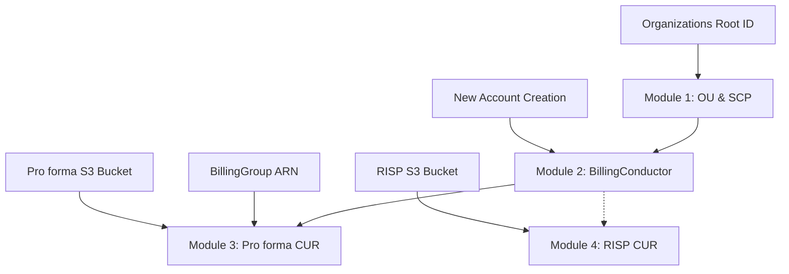

# AWS Payer自动化初始化 - 部署指南

## 部署概览

本指南提供AWS Payer自动化初始化项目的详细部署说明，包括不同部署方式、最佳实践和高级配置选项。

## 部署架构

### 部署顺序和依赖关系



### 资源创建时间线

| 模块 | 预计时间 | 关键等待点 |
|------|----------|------------|
| Module 1 | 5-10分钟 | SCP策略创建和附加 |
| Module 2 | 15-30分钟 | **账户创建过程** |
| Module 3 | 5-10分钟 | S3存储桶和CUR配置 |
| Module 4 | 5-10分钟 | RISP S3存储桶和CUR配置 |

## 部署方式

### 1. 一键完整部署

适用于新环境的完整自动化部署。

#### 命令执行
```bash
# 进入项目目录
cd aws-payer-automation

# 执行完整部署
./scripts/deploy.sh
```

#### 执行流程
1. **前置检查**：验证AWS CLI配置和权限
2. **依赖验证**：检查Organizations状态和Root ID
3. **顺序部署**：按依赖关系部署所有模块
4. **状态监控**：等待每个模块完成后继续下一个
5. **结果输出**：提供部署摘要和关键信息

#### 示例输出
```
[INFO] Starting AWS Payer Automation Deployment
[INFO] Timestamp: 1699123456
[SUCCESS] AWS CLI is configured
[SUCCESS] Prerequisites check passed
[INFO] Root ID: r-abcd1234efgh5678

[INFO] Deploying Module 1: OU and SCP Setup
[SUCCESS] Module 1 deployed successfully: payer-ou-scp-1699123456

[INFO] Deploying Module 2: BillingConductor Setup
[INFO] Waiting for create to complete for stack: payer-billing-conductor-1699123456
[SUCCESS] Module 2 deployed successfully: payer-billing-conductor-1699123456
[INFO] BillingGroup ARN: arn:aws:billingconductor::123456789012:billinggroup/ABCDEFGH

[INFO] Deploying Module 3: Pro forma CUR Export
[SUCCESS] Module 3 deployed successfully: payer-cur-proforma-1699123456

[INFO] Deploying Module 4: RISP CUR Export
[SUCCESS] Module 4 deployed successfully: payer-cur-risp-1699123456

=== Deployment Summary ===
Timestamp: 1699123456
Region: us-east-1
Root ID: r-abcd1234efgh5678

Deployed Stacks:
  1. OU and SCP: payer-ou-scp-1699123456
  2. BillingConductor: payer-billing-conductor-1699123456
  3. Pro forma CUR: payer-cur-proforma-1699123456
  4. RISP CUR: payer-cur-risp-1699123456

BillingGroup ARN: arn:aws:billingconductor::123456789012:billinggroup/ABCDEFGH

[SUCCESS] All modules deployed successfully!
[WARNING] Note: CUR reports may take up to 24 hours to generate first data
```

### 2. 分步骤部署

适用于需要逐步验证或分阶段部署的场景。

#### Step 1: 部署OU和SCP
```bash
# 获取Root ID
ROOT_ID=$(aws organizations list-roots --query 'Roots[0].Id' --output text)

# 部署Module 1
./scripts/deploy-single.sh 1 --root-id $ROOT_ID

# 验证OU创建
aws organizations list-organizational-units-for-parent --parent-id $ROOT_ID
```

#### Step 2: 部署BillingConductor
```bash
# 部署Module 2
./scripts/deploy-single.sh 2

# 监控部署进度（账户创建可能需要30分钟）
watch -n 60 "aws cloudformation describe-stack-events --stack-name payer-billing-conductor-* --max-items 3"
```

#### Step 3: 获取中间结果
```bash
# 获取BillingGroup ARN
BILLING_GROUP_ARN=$(aws cloudformation describe-stacks \
  --stack-name payer-billing-conductor-* \
  --query 'Stacks[0].Outputs[?OutputKey==`BillingGroupArn`].OutputValue' \
  --output text)

echo "BillingGroup ARN: $BILLING_GROUP_ARN"

# 获取新账户信息
NEW_ACCOUNT_ID=$(aws cloudformation describe-stacks \
  --stack-name payer-billing-conductor-* \
  --query 'Stacks[0].Outputs[?OutputKey==`NewAccountId`].OutputValue' \
  --output text)

echo "New Account ID: $NEW_ACCOUNT_ID"
```

#### Step 4: 部署CUR模块
```bash
# 部署Pro forma CUR
./scripts/deploy-single.sh 3 --billing-group-arn $BILLING_GROUP_ARN

# 部署RISP CUR（并行执行）
./scripts/deploy-single.sh 4 &

# 等待两个CUR部署完成
wait
```

### 3. 自定义参数部署

适用于需要特定配置的部署场景。

#### 手动CloudFormation部署
```bash
# Module 1 - 自定义栈名称
aws cloudformation create-stack \
    --stack-name my-custom-ou-scp-stack \
    --template-body file://templates/01-ou-scp/auto_SCP_1.yaml \
    --parameters ParameterKey=RootId,ParameterValue=r-abcd1234efgh5678 \
    --capabilities CAPABILITY_NAMED_IAM \
    --region us-east-1 \
    --tags Key=Environment,Value=Production Key=Project,Value=PayerAutomation

# Module 2 - 添加通知配置
aws cloudformation create-stack \
    --stack-name my-custom-billing-conductor \
    --template-body file://templates/02-billing-conductor/billing_conductor.yaml \
    --capabilities CAPABILITY_NAMED_IAM \
    --region us-east-1 \
    --notification-arns arn:aws:sns:us-east-1:123456789012:deployment-notifications
```

#### 使用参数文件
```bash
# 创建参数文件
cat > module1-params.json << 'EOF'
[
    {
        "ParameterKey": "RootId",
        "ParameterValue": "r-abcd1234efgh5678"
    }
]
EOF

# 使用参数文件部署
aws cloudformation create-stack \
    --stack-name payer-ou-scp-custom \
    --template-body file://templates/01-ou-scp/auto_SCP_1.yaml \
    --parameters file://module1-params.json \
    --capabilities CAPABILITY_NAMED_IAM
```

## 高级部署选项

### 1. 多环境部署

#### 环境隔离策略
```bash
# 开发环境
ENVIRONMENT=dev
STACK_PREFIX="payer-dev"

# 生产环境  
ENVIRONMENT=prod
STACK_PREFIX="payer-prod"

# 使用环境前缀部署
aws cloudformation create-stack \
    --stack-name ${STACK_PREFIX}-ou-scp-$(date +%s) \
    --template-body file://templates/01-ou-scp/auto_SCP_1.yaml \
    --parameters ParameterKey=RootId,ParameterValue=$ROOT_ID \
    --capabilities CAPABILITY_NAMED_IAM \
    --tags Key=Environment,Value=$ENVIRONMENT
```

#### 配置管理
```bash
# 环境配置文件
mkdir -p config/environments

# 开发环境配置
cat > config/environments/dev.json << 'EOF'
{
    "StackPrefix": "payer-dev",
    "Environment": "development",
    "Tags": [
        {"Key": "Environment", "Value": "dev"},
        {"Key": "CostCenter", "Value": "development"}
    ]
}
EOF

# 生产环境配置
cat > config/environments/prod.json << 'EOF'
{
    "StackPrefix": "payer-prod",
    "Environment": "production",
    "Tags": [
        {"Key": "Environment", "Value": "prod"},
        {"Key": "CostCenter", "Value": "operations"}
    ]
}
EOF
```

### 2. CI/CD集成

#### GitHub Actions示例
```yaml
# .github/workflows/deploy-payer-automation.yml
name: Deploy Payer Automation

on:
  push:
    branches: [main]
  workflow_dispatch:
    inputs:
      environment:
        description: 'Deployment environment'
        required: true
        default: 'dev'
        type: choice
        options:
        - dev
        - staging
        - prod

jobs:
  deploy:
    runs-on: ubuntu-latest
    
    steps:
    - uses: actions/checkout@v3
    
    - name: Configure AWS credentials
      uses: aws-actions/configure-aws-credentials@v2
      with:
        aws-access-key-id: ${{ secrets.AWS_ACCESS_KEY_ID }}
        aws-secret-access-key: ${{ secrets.AWS_SECRET_ACCESS_KEY }}
        aws-region: us-east-1
    
    - name: Validate templates
      run: ./scripts/validate.sh
    
    - name: Deploy to ${{ github.event.inputs.environment || 'dev' }}
      run: |
        export ENVIRONMENT=${{ github.event.inputs.environment || 'dev' }}
        ./scripts/deploy.sh
```

#### Jenkins Pipeline示例
```groovy
pipeline {
    agent any
    
    parameters {
        choice(
            name: 'ENVIRONMENT',
            choices: ['dev', 'staging', 'prod'],
            description: 'Deployment environment'
        )
        booleanParam(
            name: 'DRY_RUN',
            defaultValue: false,
            description: 'Perform dry run validation only'
        )
    }
    
    stages {
        stage('Validate') {
            steps {
                sh './scripts/validate.sh'
            }
        }
        
        stage('Deploy') {
            when {
                not { params.DRY_RUN }
            }
            steps {
                withAWS(credentials: 'aws-credentials', region: 'us-east-1') {
                    sh """
                        export ENVIRONMENT=${params.ENVIRONMENT}
                        ./scripts/deploy.sh
                    """
                }
            }
        }
    }
    
    post {
        always {
            sh './scripts/cleanup.sh --list'
        }
    }
}
```

### 3. 故障恢复和回滚

#### 自动回滚脚本
```bash
#!/bin/bash
# rollback-deployment.sh

DEPLOYMENT_TIMESTAMP=$1

if [ -z "$DEPLOYMENT_TIMESTAMP" ]; then
    echo "Usage: $0 <deployment_timestamp>"
    exit 1
fi

echo "Rolling back deployment: $DEPLOYMENT_TIMESTAMP"

# 获取相关栈
STACKS=$(aws cloudformation list-stacks \
    --query "StackSummaries[?contains(StackName, '$DEPLOYMENT_TIMESTAMP')].StackName" \
    --output text)

# 按逆序删除栈
for stack in $(echo $STACKS | tr ' ' '\n' | sort -r); do
    echo "Deleting stack: $stack"
    aws cloudformation delete-stack --stack-name $stack
    aws cloudformation wait stack-delete-complete --stack-name $stack
done

echo "Rollback completed"
```

#### 检查点和恢复
```bash
#!/bin/bash
# create-checkpoint.sh

TIMESTAMP=$(date +%s)
CHECKPOINT_DIR="checkpoints/$TIMESTAMP"
mkdir -p $CHECKPOINT_DIR

# 保存当前栈状态
aws cloudformation list-stacks \
    --query 'StackSummaries[?starts_with(StackName, `payer-`)].{Name:StackName,Status:StackStatus}' \
    --output json > $CHECKPOINT_DIR/stacks.json

# 保存关键输出
for stack in $(aws cloudformation list-stacks --query 'StackSummaries[?starts_with(StackName, `payer-`)].StackName' --output text); do
    aws cloudformation describe-stacks --stack-name $stack > $CHECKPOINT_DIR/$stack.json
done

echo "Checkpoint created: $CHECKPOINT_DIR"
```

## 监控和验证

### 1. 部署监控

#### 实时监控脚本
```bash
#!/bin/bash
# monitor-deployment.sh

STACK_NAME=$1

if [ -z "$STACK_NAME" ]; then
    echo "Usage: $0 <stack-name>"
    exit 1
fi

echo "Monitoring stack: $STACK_NAME"

while true; do
    STATUS=$(aws cloudformation describe-stacks --stack-name $STACK_NAME --query 'Stacks[0].StackStatus' --output text 2>/dev/null)
    
    if [ $? -ne 0 ]; then
        echo "Stack not found or error occurred"
        break
    fi
    
    echo "$(date): $STATUS"
    
    case $STATUS in
        *COMPLETE)
            echo "Stack operation completed"
            break
            ;;
        *FAILED)
            echo "Stack operation failed"
            aws cloudformation describe-stack-events --stack-name $STACK_NAME --max-items 5
            break
            ;;
    esac
    
    sleep 30
done
```

#### 健康检查
```bash
#!/bin/bash
# health-check.sh

echo "=== Payer Automation Health Check ==="

# 检查所有栈状态
echo "Stack Status:"
aws cloudformation list-stacks \
    --query 'StackSummaries[?starts_with(StackName, `payer-`)].{Name:StackName,Status:StackStatus}' \
    --output table

# 检查Organizations结构
echo -e "\nOrganizational Units:"
ROOT_ID=$(aws organizations list-roots --query 'Roots[0].Id' --output text)
aws organizations list-organizational-units-for-parent --parent-id $ROOT_ID --output table

# 检查CUR报告
echo -e "\nCUR Reports:"
aws cur describe-report-definitions --region us-east-1 --output table

# 检查S3存储桶
echo -e "\nS3 Buckets:"
aws s3 ls | grep bip-

echo -e "\nHealth check completed"
```

### 2. 自动化测试

#### 集成测试脚本
```bash
#!/bin/bash
# integration-test.sh

set -e

echo "Starting integration tests..."

# Test 1: OU结构验证
echo "Test 1: OU Structure"
ROOT_ID=$(aws organizations list-roots --query 'Roots[0].Id' --output text)
OU_COUNT=$(aws organizations list-organizational-units-for-parent --parent-id $ROOT_ID --query 'length(OrganizationalUnits)')

if [ "$OU_COUNT" -ge 3 ]; then
    echo "✓ OU structure test passed"
else
    echo "✗ OU structure test failed"
    exit 1
fi

# Test 2: SCP策略验证
echo "Test 2: SCP Policies"
SCP_COUNT=$(aws organizations list-policies --filter SERVICE_CONTROL_POLICY --query 'length(Policies)')

if [ "$SCP_COUNT" -ge 7 ]; then
    echo "✓ SCP policies test passed"
else
    echo "✗ SCP policies test failed"
    exit 1
fi

# Test 3: BillingGroup验证
echo "Test 3: BillingGroup"
BG_COUNT=$(aws billingconductor list-billing-groups --region us-east-1 --query 'length(BillingGroups)')

if [ "$BG_COUNT" -ge 1 ]; then
    echo "✓ BillingGroup test passed"
else
    echo "✗ BillingGroup test failed"
    exit 1
fi

# Test 4: CUR报告验证
echo "Test 4: CUR Reports"
CUR_COUNT=$(aws cur describe-report-definitions --region us-east-1 --query 'length(ReportDefinitions)')

if [ "$CUR_COUNT" -ge 2 ]; then
    echo "✓ CUR reports test passed"
else
    echo "✗ CUR reports test failed"
    exit 1
fi

echo "All integration tests passed!"
```

## 性能优化

### 1. 并行部署

#### 模块级并行化
```bash
#!/bin/bash
# parallel-deploy.sh

# 部署Module 1
./scripts/deploy-single.sh 1 --root-id $ROOT_ID &
MODULE1_PID=$!

# 等待Module 1完成
wait $MODULE1_PID

# 部署Module 2
./scripts/deploy-single.sh 2 &
MODULE2_PID=$!

# 等待Module 2完成并获取BillingGroup ARN
wait $MODULE2_PID
BILLING_GROUP_ARN=$(get_billing_group_arn)

# 并行部署Module 3和4
./scripts/deploy-single.sh 3 --billing-group-arn $BILLING_GROUP_ARN &
MODULE3_PID=$!

./scripts/deploy-single.sh 4 &
MODULE4_PID=$!

# 等待所有模块完成
wait $MODULE3_PID $MODULE4_PID

echo "Parallel deployment completed"
```

### 2. 资源优化

#### Lambda函数优化
- 增加内存分配以提高执行速度
- 使用环境变量减少初始化时间
- 实现连接池以优化AWS API调用

#### CloudFormation优化
- 使用嵌套栈减少单个栈的复杂性
- 实现条件部署减少不必要的资源创建
- 使用自定义资源类型提高重用性

本部署指南提供了全面的部署选项和最佳实践。根据具体需求选择合适的部署方式，并结合监控和测试确保部署成功。